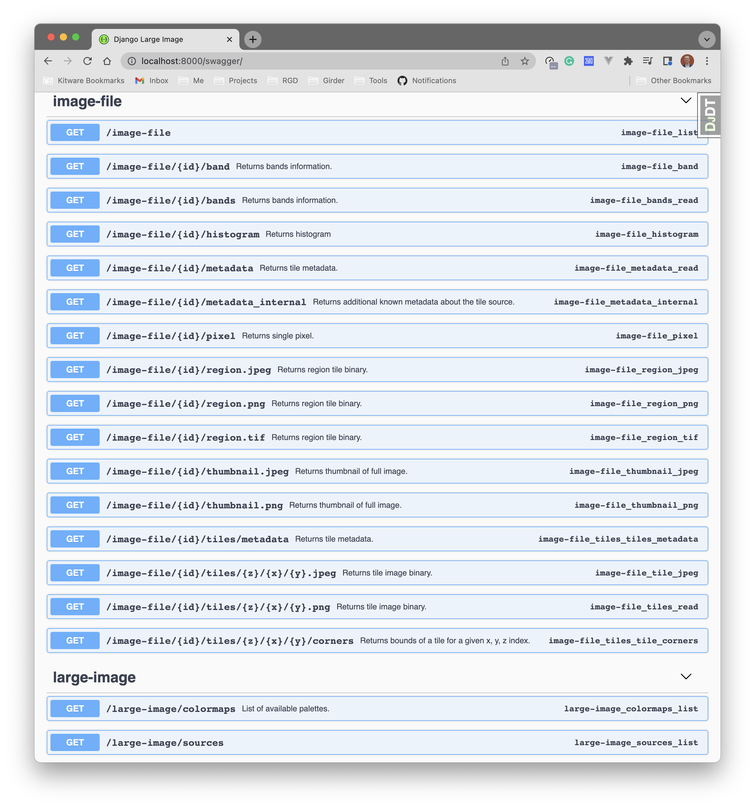

# django-large-image

[](https://codecov.io/gh/ResonantGeoData/django-large-image)

Abstract endpoints for working with large images in Django -- specifically
geared towards geospatial tile serving.

*DISCLAIMER:* this is a work in progress and is currently in an experimental phase.



## Implementation

We are working to port Kitware's [large-image](https://github.com/girder/large_image)
to Django by providing a set of abstract, mixin API view classes that will
handle tile serving, fetching metadata from images, and extracting regions of
interest.

`django-large-image` is not currently an installable Django app, but rather
a few classes that can be mixed into a Django project (or application)'s views
to provide tile serving endpoints out of the box.

`django-large-image` presently supports and FieldFile interface with validated
use cases for `FileField` and `S3FileField`. We are working to also support
GeoDjango's [`GDALRaster`](https://docs.djangoproject.com/en/4.0/ref/contrib/gis/gdal/#django.contrib.gis.gdal.GDALRaster).

This module ships with a pre-built HTML tempate for rendering geospatial tiles
with CesiumJS.

### Usage

To use the mixin classes provided here, create a model, serializer, and view in
your Django project like so:

```py
models.py
---
from django.db import models
from rest_framework import serializers


class ImageFile(models.Model):
    file = models.FileField()


class ImageFileSerializer(serializers.ModelSerializer):
    class Meta:
        model = ImageFile
        fields = '__all__'
```

```py
admin.py
---
from django.contrib import admin
from example.core.models import ImageFile


@admin.register(ImageFile)
class ImageFileAdmin(admin.ModelAdmin):
    list_display = ('pk',)
```

Then create the views, mixing in the `django-large-image` view class:
```py
viewsets.py
---
from django.contrib.auth.mixins import LoginRequiredMixin
from example.core import models
from rest_framework import mixins, viewsets

from django_large_image.rest import LargeImageView


class ImageFileDetailView(
    LoginRequiredMixin,
    mixins.ListModelMixin,
    viewsets.GenericViewSet,
    LargeImageView,
):
    queryset = models.ImageFile.objects.all()
    serializer_class = models.ImageFileSerializer
    FILE_FIELD_NAME = 'file'  # the name of the image FileField on your model
```

Then register the URLs:

```py
urls.py
---
from django.urls import path
from example.core.viewsets import ImageFileDetailView
from rest_framework.routers import SimpleRouter

router = SimpleRouter(trailing_slash=False)
router.register(r'api/large-image', ImageFileDetailView, basename='large-image')

urlpatterns = [
  path('', include('django_large_image.urls')),
] + router.urls

```

## Work Plan

Our primary goal is to get through phases 1 and 2, focusing on tile serving of
large geospatial images specifically in Cloud Optimized GeoTiff (COG) format.

### Phase 1

- [x] Abstract API View classes that can be mixed-in downstream to expose all available endpoints
  - [x] endpoints for metadata (/tiles, /tiles/internal_metadata)
  - [x] endpoints for serving tiles (/tiles/zxy, /tiles/fzxy)
  - [x] cache management - tile sources should be cached so that we don't open a file for each tile
  - [x] endpoint for regions
  - [x] endpoint for thumbnails
  - [x] thumbnail caching
  - [x] endpoint for individual pixels
  - [x] endpoint for histograms
  - [x] some diagnostic and settings endpoints (list available sources, set whether to automatically use large_images and the size of small images that can be used)
- [x] Support for django's FileFeild
- [x] Support for S3FileField
- [x] Ship an easily extensible SSR template for tile viewing with CesiumJS
- [x] Support for using file URLs with GDAL's VSI
- [x] Provide OpenAPI documentation in swagger

### Phase 2

- [ ] Refactor/prototpye RGD's ChecksumFile model as a FieldFile subclass
- [ ] Support GeoDjango's [`GDALRaster`](https://docs.djangoproject.com/en/4.0/ref/contrib/gis/gdal/#django.contrib.gis.gdal.GDALRaster)
- [ ] Tie large-image's caching into Django's cache (might require upstream work in large-image)
- [ ] Provide some sort of endpoint to check if an image is a valid COG

### Phase 3 and onward

Incorporate more features from large-image.

Things that would require implementing tasks with celery:

- [ ] ability to convert images via large_image_converter
- [ ] async endpoint for regions

Things I'm unsure about:

- [ ] endpoints for associated images
- [ ] ability to precache thumbnails (the thumbnail jobs endpoints)
- [ ] endpoints for serving tiles in deepzoom format

Things I think should be implemented downstream:

- endpoint or method to make / unmake a Django file field into a large_image item
- fuse-like ability to access filefields as os-level files (until implemented, s3 files will need to be pulled locally to serve them, which is inefficient)
